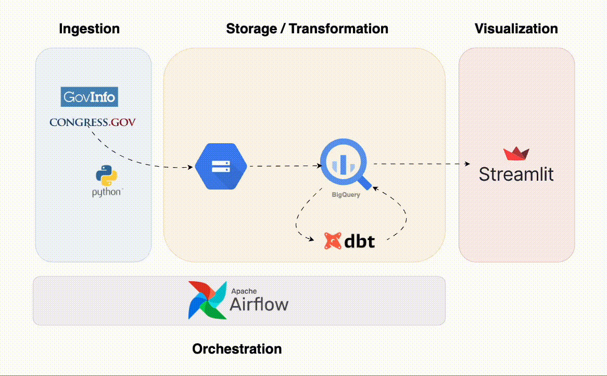

# Project Objective
In this project, I created a pipeline and web tool that allows users to analyze congressional legislation and voting data by member. The data is sourced from GovInfo.gov and Congress.gov. The link to the streamlit web app can be found [here](https://congress-pipeline-4347055658.us-central1.run.app/).

The pipeline defines a dimensional model by creating a fact (roll call vote) table and multiple dimension tables which contain information on members, vote metadata and congressional committees. The data used is for the previous (118th) and current (119th) US Congresses.

This project was originally created for the [Data Talks Club Data Engineering Zoomcamp](https://github.com/DataTalksClub/data-engineering-zoomcamp/tree/main).

# Data
Information on the API and bulk data download used in this project can be found [here](https://www.congress.gov/help/using-data-offsite) and [here](https://www.govinfo.gov/bulkdata)

# Project Architecture

## Extraction
Data is incrementally extracted by filtering data more recent than the latest 'update' date in the target warehouse.

**Bills**
* Bills are downloaded from GovInfo bulk data website

**Votes**
* Roll call votes are extracted by parsing bill jsons
* Roll call vote XMLs are downloaded using roll call vote urls

**Members**
* Member data is downloaded from the Congress API

## Storage and Transformation
* Raw extracted files are uploaded to GCS buckets 
* Files are loaded into staging tables and parsed into final fact/dim tables using DBT

# Dashboard
In addition to the pipeline, I've created a [streamlit app](https://congress-pipeline-4347055658.us-central1.run.app/) to allow users to interact with the data. The instance of the data pipeline which feeds the app is hosted on a Google Cloud VM and runs every weeknight. The Streamlit app runs on a Google Cloud Run instance.

